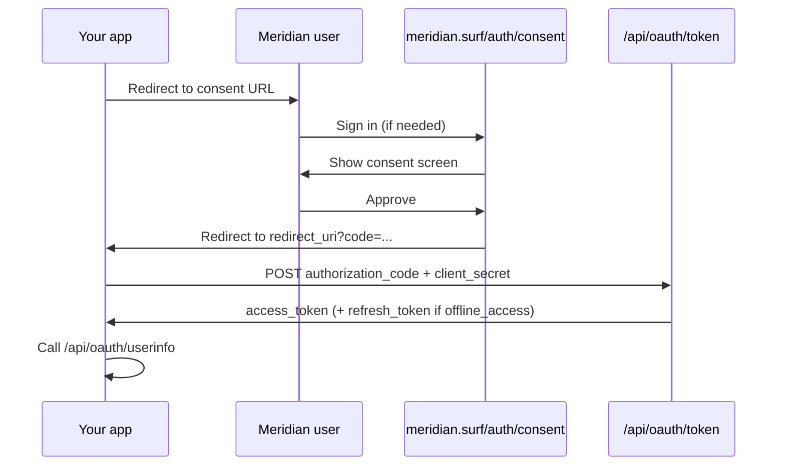

Meridian supports the **authorization code** grant with optional refresh tokens. All applications are confidential clients and require a client secret. Public clients are not supported.



## Credentials

| Field | Notes |
| --- | --- |
| **Client id** | Public identifier. Safe to embed in authorization links. |
| **Client secret** | Required when exchanging codes or refresh tokens at `/api/oauth/token`. |

Create and manage apps at [developer.meridian.surf](https://developer.meridian.surf).

## Redirect URIs

- At least one redirect URI is required per application.
- Production URIs must use `https://`.
- Authorization requests must match a registered URI **exactly** (path included). Meridian appends query parameters on callback.

<Tip>
  Register every callback URL your app uses. Meridian does not support wildcard or pattern matching.
</Tip>

## Authorization

```text
GET https://meridian.surf/auth/consent
```

<ParamField query="client_id" type="string" required>
  Your application's client id from the developer portal.
</ParamField>

<ParamField query="redirect_uri" type="string" required>
  Must exactly match a URI registered on the application.
</ParamField>

<ParamField query="response_type" type="string" required>
  Must be `code`.
</ParamField>

<ParamField query="scope" type="string" required>
  Space-separated list of [scopes](/api/scopes).
</ParamField>

<ParamField query="state" type="string">
  Opaque value returned unchanged on redirect. Use this on every request for CSRF protection.
</ParamField>

<ParamField query="consent" type="string">
  Set to `skip` to bypass the consent screen when the user has already granted the requested scopes. If additional scopes are needed, Meridian redirects with `error=consent_required`.
</ParamField>

### Success redirect

```text
{redirect_uri}?code={authorization_code}&state={state}
```

Authorization codes expire after **5 minutes** and are single-use.

### Error redirects

```text
{redirect_uri}?error=access_denied&state={state}
{redirect_uri}?error=consent_required&state={state}
```

### PIN unlock

These scopes require the user to unlock their session PIN before authorization:

- `user.email`
- `user.connections.read`
- Any scope ending in `.write` or `.manage`

## Tokens

```text
POST https://meridian.surf/api/oauth/token
```

Accepts `application/json` or `application/x-www-form-urlencoded`.

| Token | Prefix | Lifetime |
| --- | --- | --- |
| Access | `mrdn_at_` | 15 minutes (900 seconds) |
| Refresh | `mrdn_rt_` | 30 days (requires `offline_access`) |
| Authorization code | `mrdn_ac_` | 5 minutes, single-use |

Refresh token rotation is enabled. Each successful refresh revokes the previous refresh token. Reusing a revoked refresh token revokes the entire token family.

## Revoke

```text
POST https://meridian.surf/api/oauth/revoke
```

Send `token` (required) and optional `token_type_hint` (`access_token` or `refresh_token`). Returns `200` with an empty body on success (RFC 7009). Revoking a refresh token revokes its entire token family.

## Security

- Store client secrets server-side only. Never ship them in client-side code or mobile apps.
- Send `state` on every authorization request.
- Exchange authorization codes immediately.
- Rotate client secrets if you suspect exposure. Rotation invalidates the old secret immediately.
- Treat access tokens as bearer credentials.
- Do not log client secrets, authorization codes, or access tokens.