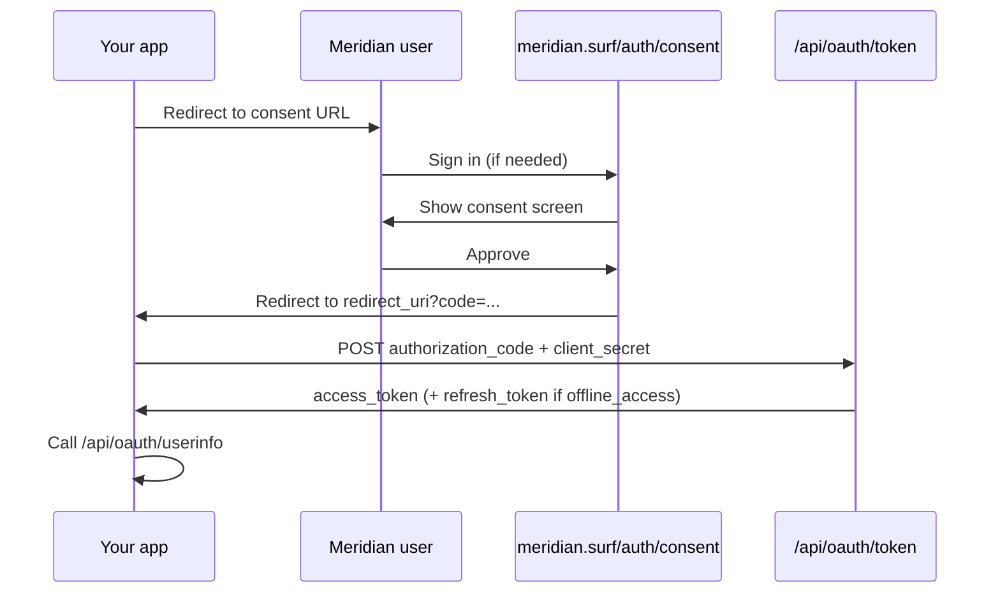

The Meridian developer portal is where you register OAuth applications that request access to a Meridian user's account.

[developer.meridian.surf](https://developer.meridian.surf)

Use it to:

- Create and manage OAuth applications
- Configure redirect URIs and consent-screen metadata
- Copy client credentials and build authorization URLs
- Integrate with Meridian's OAuth 2.0 authorization code flow

<Note>
  This portal is for Meridian OAuth integrations. It is not the [Discord Developer Portal](https://discord.com/developers/applications), which is for Discord bot tokens and application settings.
</Note>

## Endpoints

| Surface | URL |
| --- | --- |
| Developer portal | `https://developer.meridian.surf` |
| OAuth consent | `https://meridian.surf/auth/consent` |
| Token | `https://meridian.surf/api/oauth/token` |
| Userinfo | `https://meridian.surf/api/oauth/userinfo` |
| Revoke | `https://meridian.surf/api/oauth/revoke` |
| OpenAPI spec | `https://docs-backend.meridian.surf/openapi.json` |
| OAuth example | `https://developer.meridian.surf/example` |

## API specification

OAuth endpoints are documented in prose below. For machine-readable schemas, request bodies, and response shapes, use the [OpenAPI spec](https://docs-backend.meridian.surf/openapi.json).

Import it into Postman, Insomnia, or your codegen tool of choice. The spec covers token exchange, userinfo, and revoke.

## Portal routes

| Path | Purpose |
| --- | --- |
| `/` | List your OAuth applications |
| `/apps/new` | Register a new application |
| `/apps/{applicationId}` | Credentials, authorization URL generator, and settings |

Sign in with your Meridian account. If you are not signed in, you are redirected to Meridian auth and returned to the portal afterward.

## Register an application

1. Open the [developer portal](https://developer.meridian.surf) and click **New application**.
2. Provide:
   - **Name** (required, max 80 characters)
   - **Description** (max 400 characters; shown on the consent screen)
   - **Website URL** (required; valid `https://` URL)
   - **Redirect URIs** (at least one; see [Redirect URIs](#redirect-uris))
3. Click **Create application**.

New applications are confidential clients with a client secret. The secret is shown once on the confirmation screen. Copy it before leaving the page.

<Warning>
  Client secrets are only shown at creation or after rotation. After that, the portal displays a masked value. Store secrets in your own secret manager immediately.
</Warning>

## Manage an application

Each application has three tabs.

### Credentials

| Field | Notes |
| --- | --- |
| **Client id** | Public identifier. Safe to embed in authorization links. |
| **Client secret** | Required when exchanging codes or refresh tokens at `/api/oauth/token`. |

All applications require a client secret. Public clients are not supported.

### Authorization

The **Authorization URL generator** helps you build and test consent links:

- Pick a registered redirect URI
- Select scopes
- Optionally set `state`
- Optionally enable **Skip consent when already granted** (`consent=skip`)

### Settings

Update name, description, website URL, and redirect URIs. These fields appear on the consent screen.

**Revoke application** permanently disables the app, removes all user authorizations, and invalidates outstanding tokens. Revocation requires PIN or passkey confirmation.

## Meridian verified applications

Official Meridian-owned apps can be marked **Meridian verified**. Verified apps show the Meridian seal on the consent screen. Third-party apps are unverified by default.

## Connected apps (end users)

Meridian users manage authorized apps from their account under **Connected apps**. When a user revokes access, their authorization is deleted and that app's tokens for that user are invalidated.

## OAuth integration example

Meridian includes a live userinfo preview at [developer.meridian.surf/example](https://developer.meridian.surf/example). Use it to inspect `/api/oauth/userinfo` responses without building a full integration first.

| Environment | Example URL | Callback redirect URI |
| --- | --- | --- |
| Production | `https://developer.meridian.surf/example` | `https://developer.meridian.surf/example/callback` |
| Local | `http://localhost:3000/developer/example` | `http://localhost:3000/developer/example/callback` |

<Steps>
  <Step title="Register the callback URI">
    Add the callback redirect URI to your OAuth app. It must match exactly (including `http` vs `https` and path).
  </Step>
  <Step title="Open the Authorization tab">
    In the developer portal, open your app and go to **Authorization**. Pick the example callback URI and select scopes.
  </Step>
  <Step title="Start a fresh consent link">
    Open a new consent link from the URL generator. Stay signed in as the app owner. Codes expire in 5 minutes.
  </Step>
  <Step title="Inspect userinfo">
    After you approve, the callback exchanges the code and the example page shows the full userinfo JSON for your granted scopes.
  </Step>
</Steps>

---

## OAuth 2.0 flow

Meridian supports the **authorization code** grant with optional refresh tokens.



<Steps>
  <Step title="Redirect the user to consent">
    Send the user to `https://meridian.surf/auth/consent` with `response_type=code`.
  </Step>
  <Step title="User approves">
    Meridian redirects to your `redirect_uri` with `code` and optional `state`.
  </Step>
  <Step title="Exchange the code">
    `POST` the code to `https://meridian.surf/api/oauth/token` with your client id and secret.
  </Step>
  <Step title="Use the access token">
    Call `https://meridian.surf/api/oauth/userinfo` with `Authorization: Bearer {access_token}`.
  </Step>
  <Step title="Refresh (optional)">
    If you requested `offline_access`, refresh with `grant_type=refresh_token`.
  </Step>
</Steps>

---

## Authorization

```text
GET https://meridian.surf/auth/consent
```

### Query parameters

<ParamField query="client_id" type="string" required>
  Your application's client id from the developer portal.
</ParamField>

<ParamField query="redirect_uri" type="string" required>
  Must exactly match a URI registered on the application. Must use `https://`.
</ParamField>

<ParamField query="response_type" type="string" required>
  Must be `code`. Other response types are not supported.
</ParamField>

<ParamField query="scope" type="string" required>
  Space-separated list of [scopes](#scopes). At least one valid scope is required.
</ParamField>

<ParamField query="state" type="string">
  Opaque value returned unchanged on redirect. Use this on every request for CSRF protection.
</ParamField>

<ParamField query="consent" type="string">
  Set to `skip` to bypass the consent screen when the user has already granted the requested scopes. If additional scopes are needed, Meridian redirects to `redirect_uri` with `error=consent_required`.
</ParamField>

### Success redirect

```text
{redirect_uri}?code={authorization_code}&state={state}
```

Authorization codes expire after **5 minutes** and are single-use.

### Error redirects

User denied access:

```text
{redirect_uri}?error=access_denied&state={state}
```

`consent=skip` requested but new scopes are required:

```text
{redirect_uri}?error=consent_required&state={state}
```

### Example

```text
https://meridian.surf/auth/consent
  ?client_id=jd7abc123def456
  &redirect_uri=https%3A%2F%2Fexample.com%2Fcallback
  &response_type=code
  &scope=user.identify%20offline_access
  &state=abc123
```

### PIN unlock

These scopes require the user to unlock their session PIN before authorization:

- `user.email`
- `user.connections.read`
- Any scope ending in `.write` or `.manage`

If PIN unlock is required and the session is locked, the user completes the PIN flow and returns to consent.

---

## Token

```text
POST https://meridian.surf/api/oauth/token
```

Accepts `application/json` or `application/x-www-form-urlencoded`.

### Exchange authorization code

<ParamField body="grant_type" type="string" required>
  `authorization_code`
</ParamField>

<ParamField body="client_id" type="string" required>
  Application client id.
</ParamField>

<ParamField body="client_secret" type="string" required>
  Application client secret.
</ParamField>

<ParamField body="code" type="string" required>
  Authorization code from the redirect.
</ParamField>

<ParamField body="redirect_uri" type="string" required>
  Must match the URI used in the authorization request.
</ParamField>

<ResponseField name="access_token" type="string">
  Bearer access token (`mrdn_at_…`). Valid for **15 minutes**.
</ResponseField>

<ResponseField name="token_type" type="string">
  Always `Bearer`.
</ResponseField>

<ResponseField name="expires_in" type="number">
  Access token lifetime in seconds (900).
</ResponseField>

<ResponseField name="scope" type="string">
  Space-separated granted scopes.
</ResponseField>

<ResponseField name="refresh_token" type="string">
  Present only when `offline_access` was granted. Valid for **30 days**.
</ResponseField>

```bash
curl -X POST https://meridian.surf/api/oauth/token \
  -H "Content-Type: application/x-www-form-urlencoded" \
  -d "grant_type=authorization_code" \
  -d "client_id=YOUR_CLIENT_ID" \
  -d "client_secret=YOUR_CLIENT_SECRET" \
  -d "code=AUTHORIZATION_CODE" \
  -d "redirect_uri=https://example.com/callback"
```

### Refresh access token

<ParamField body="grant_type" type="string" required>
  `refresh_token`
</ParamField>

<ParamField body="client_id" type="string" required>
  Application client id.
</ParamField>

<ParamField body="client_secret" type="string" required>
  Application client secret.
</ParamField>

<ParamField body="refresh_token" type="string" required>
  Refresh token from a prior token response.
</ParamField>

Refresh token rotation is enabled. Each successful refresh revokes the previous refresh token. Reusing a revoked refresh token revokes the entire token family.

### Errors

| `error` | Typical cause |
| --- | --- |
| `invalid_client` | Unknown client id or wrong client secret |
| `invalid_grant` | Invalid, expired, or reused code; redirect URI mismatch |
| `invalid_request` | Missing required parameters |
| `unsupported_grant_type` | Grant type other than `authorization_code` or `refresh_token` |

---

## Userinfo

```text
GET https://meridian.surf/api/oauth/userinfo
Authorization: Bearer {access_token}
```

Returns JSON. Fields depend on granted scopes.

<ResponseField name="sub" type="string">
  Meridian user id. Always present.
</ResponseField>

<ResponseField name="meridianId" type="string">
  Same as `sub`.
</ResponseField>

<ResponseField name="name" type="string">
  Included with `user.identify`.
</ResponseField>

<ResponseField name="discordId" type="string">
  Included with `user.identify` when linked.
</ResponseField>

<ResponseField name="botCount" type="number">
  Included with `user.identify`.
</ResponseField>

<ResponseField name="email" type="string">
  Included with `user.email`.
</ResponseField>

<ResponseField name="connections" type="object">
  Included with `user.connections.read`. Whether Discord, GitHub, and passkey are linked.
</ResponseField>

<ResponseField name="bots" type="array">
  Included with `bots.read`. Bot id, name, avatar, status, plan, and role (`owner`, `editor`, `viewer`).
</ResponseField>

<ResponseField name="flows" type="array">
  Included with `flows.read`. Flow summaries (kind, name, public code).
</ResponseField>

<ResponseField name="guilds" type="array">
  Included with `guilds.read`. Discord server ids per bot.
</ResponseField>

<ResponseField name="coworkers" type="array">
  Included with `cowork.read`. Cowork members and capabilities on owned bots.
</ResponseField>

<Note>
  `bots.write`, `flows.write`, and `logs.read` are valid authorization scopes. The current userinfo endpoint returns read-oriented profile data. Write scopes gate future or separate API surfaces.
</Note>

---

## Revoke

```text
POST https://meridian.surf/api/oauth/revoke
```

<ParamField body="token" type="string" required>
  Access or refresh token to revoke.
</ParamField>

<ParamField body="token_type_hint" type="string">
  Optional: `access_token` or `refresh_token`.
</ParamField>

Returns `200` with an empty body on success. Revoking a refresh token revokes its entire token family.

---

## Scopes

Scopes are space-separated in authorization requests.

| Scope | Label | What it grants |
| --- | --- | --- |
| `user.identify` | Basic profile | Display name, Meridian id, Discord id, bot count |
| `user.email` | Email address | Primary account email (PIN required) |
| `user.connections.read` | Linked accounts | Which sign-in providers are linked (PIN required) |
| `bots.read` | Read your bots | Names, avatars, status, plan for owned or cowork bots |
| `bots.write` | Manage your bots | Change settings, deploy, restart (PIN required) |
| `flows.read` | Read automations | Read-only flow summaries |
| `flows.write` | Edit automations | Create and change flows (PIN required) |
| `guilds.read` | Read servers | Discord servers your bots are in |
| `logs.read` | Read bot logs | Recent runtime log entries |
| `cowork.read` | Read coworkers | Cowork access on owned bots |
| `offline_access` | Stay signed in | Issues a refresh token |

A typical minimal integration:

```text
user.identify offline_access
```

Request only the scopes your integration needs. Requesting scopes beyond what a user has already granted shows the consent screen again, unless you use `consent=skip` and the requested scopes are already covered.

---

## Redirect URIs

- At least one redirect URI is required per application.
- URIs must use `https://`.
- Authorization requests must match a registered URI **exactly** (path included). Meridian appends query parameters on callback.

<Tip>
  Register every callback URL your app uses. Meridian does not support wildcard or pattern matching.
</Tip>

---

## Security

- Store client secrets server-side only. Never ship them in client-side code or mobile apps.
- Send `state` on every authorization request.
- Exchange authorization codes immediately. They expire in 5 minutes.
- Rotate client secrets if you suspect exposure. Rotation invalidates the old secret immediately.
- Treat access tokens as bearer credentials.
- Do not log client secrets, authorization codes, or access tokens.

---

## Quick start

<AccordionGroup>
  <Accordion title="1. Register your app">
    Sign in at [developer.meridian.surf](https://developer.meridian.surf), create an application, and copy the client id and secret.
  </Accordion>

  <Accordion title="2. Add redirect URIs">
    Register every `https://` callback URL your app uses.
  </Accordion>

  <Accordion title="3. Build the consent link">
    Use the Authorization tab URL generator, or construct the consent URL manually.
  </Accordion>

  <Accordion title="4. Handle the callback">
    Read `code` from the query string. Handle `error=access_denied` and `error=consent_required`.
  </Accordion>

  <Accordion title="5. Exchange and call userinfo">
    POST to `/api/oauth/token`, then GET `/api/oauth/userinfo` with the access token.
  </Accordion>
</AccordionGroup>